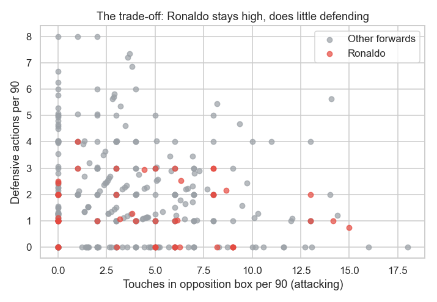
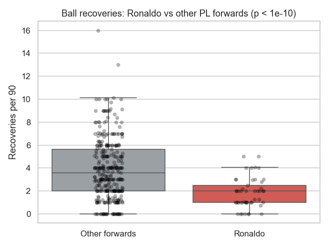
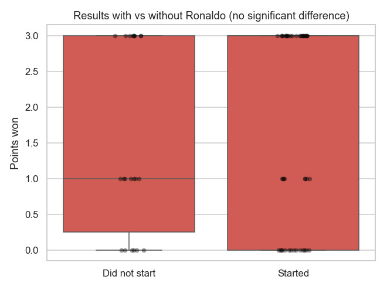

# Was Ronaldo the Problem? A Statistical Look at His Second Manchester United Stint

Cristiano Ronaldo's second spell at Manchester United (September 2021 – November 2022)
is often blamed for the team's decline — the usual charge being that *he didn't press*,
breaking the team's defensive structure. This project tests that claim with data instead
of narrative, using deliberately simple, transparent statistics.

## Headline finding: a trade-off, not a verdict

- **The criticism holds at the individual level.** Ronaldo recovered the ball far less
  than comparable forwards — **1.8 vs 3.9 recoveries per 90** (p ≈ 1.6×10⁻¹⁴, large
  effect). It survives the fairest test: versus *only* other centre-forwards he's still
  significantly lower (1.8 vs 2.8, p < 0.001), in the 29th percentile.
- **But he gave more going the other way.** His expected goals were significantly
  *higher* than peers (**0.61 vs 0.35 xG per 90**, p = 0.002), and he stayed higher up
  the pitch.
- **And the team didn't measurably suffer.** With vs without Ronaldo, United's pressing
  intensity, xG conceded, points, and win rate showed **no significant difference** — and
  once you adjust for him starting against weaker opponents, the small raw gaps vanish.

> **Conclusion:** Ronaldo did significantly *less* defensive work *and* significantly
> *more* attacking work than comparable forwards, while the team's overall output did not
> measurably change. "Ronaldo was the problem" isn't supported by the match data — the
> honest story is a stylistic trade-off.

### The profile, in one chart

Ronaldo (red) sits bottom-right: high up the pitch, low defensive work.

## Method

Two levels of analysis, both using simple methods (Welch t-tests, ANOVA-style group means,
Fisher's exact test, correlation, linear/logistic regression via `statsmodels`, Cohen's *d*,
percentiles):

1. **Team level (within-stint).** All 67 of United's competitive matches during the stint,
   comparing games Ronaldo started vs did not, controlling for opponent strength (market
   win probability), manager, and venue. A within-stint design avoids the confounding that
   wrecks a naïve pre/during/post comparison — across those periods the manager *and* squad
   both changed, so a period effect can't be attributed to Ronaldo.
2. **Player level (the mechanism).** Per-90 defensive and attacking output for Ronaldo
   (49 match-appearances) vs other Premier League forwards in the same matches
   (329 forward-matches), with robustness checks vs United teammates only, vs
   centre-forwards only, and at the player-aggregate level.

A consolidated table of all 15 tests with p-values, effect sizes, and a Bonferroni
correction is in [`results_summary.csv`](results_summary.csv).

### Results were *not* significant — and that matters

Showing the null result is part of the point: it rules out the simplest "he made them
lose" claim (points p = 0.63; win rate p = 0.45; both vanish under controls).

## Data sources

- **[football-data.co.uk](https://www.football-data.co.uk)** — Premier League results and
  betting odds (free to use). Included in this repo (`raw/`).
- **FotMob** (Opta-derived) — match and player statistics. Used for **personal, educational
  analysis only.** The data-collection code and the provider-sourced datasets are **not
  included or redistributed** here; this repo contains the cleaning/analysis code and the
  aggregated results and figures produced from that data. Scores were validated against
  football-data (49/49 PL matches matched exactly) and Ronaldo's appearances reconcile to
  the known 54.

## Files

| File | Purpose |
|------|---------|
| `finalize.py` | Build the match-level dataset (manager, rest, opponent strength, validation) |
| `extract_players.py` | Build the forward-level (per-90) dataset |
| `ronaldo_analysis.py` | The analysis (team + player level) and figures |
| `results_summary.csv` | All 15 tests: p-values, effect sizes, Bonferroni flags |
| `py_*.png` | Figures |
| `raw/` | football-data.co.uk Premier League CSVs |

*The provider-sourced match/player datasets are not committed (see Data sources). The
analysis code, results, and figures here document the methodology and findings.*

## Running it locally

`ronaldo_analysis.py` reads two datasets that are **not included** (they're derived from
FotMob — see Data sources): `ronaldo_stint_dataset.csv` (match level) and
`forward_match_stats.csv` (forward-per-90 level). To document the exact expected format,
this repo ships two mock files with fictional data and identical column names:

| Mock file | Replace with |
|-----------|--------------|
| `mock_ronaldo_stint_dataset.csv` | your own `ronaldo_stint_dataset.csv` |
| `mock_forward_match_stats.csv` | your own `forward_match_stats.csv` |

To run the analysis locally, supply your own formatted statistics datasets matching these
column schemas (rename the mock files, or point the script at your data).

## Limitations

- Observational data, single club: associations, not proven causation.
- "Recoveries / defensive actions" is a defensive **work-rate proxy**, not StatsBomb
  "pressures" (no longer publicly served for this era).
- Match-level t-tests involve repeated observations of the same players; the player-level
  percentile checks address this, but a mixed-effects model is the rigorous next step.
- The "without Ronaldo" team sample is small (22 matches), so team-level nulls are
  underpowered as much as they are genuine.
